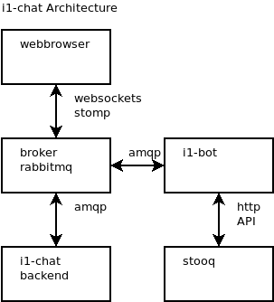
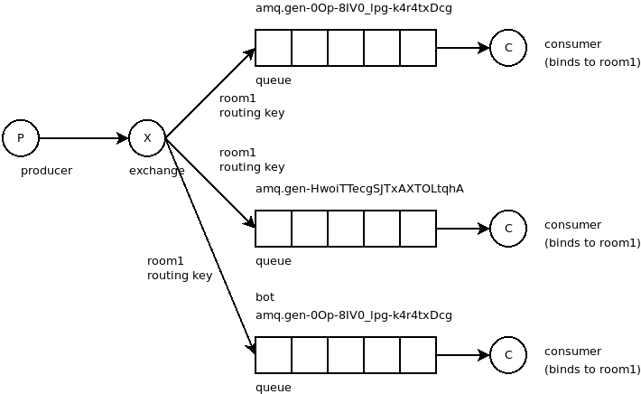
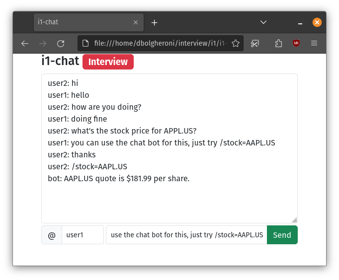
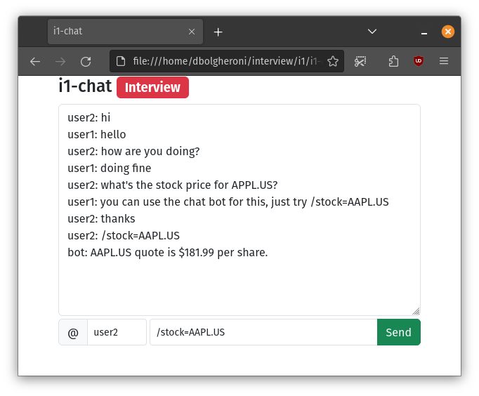
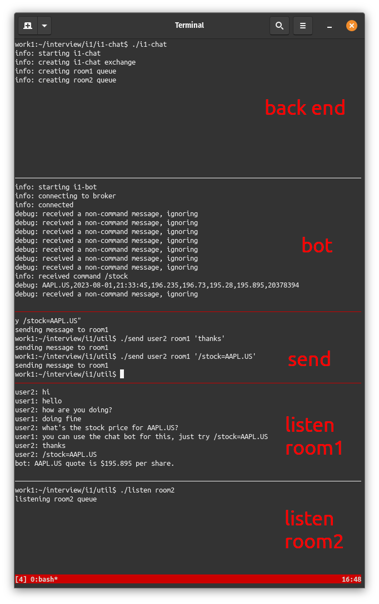

# i1-chat

*i1-chat* is an interview project. The idea is to create a C++ back end for
a chat application. It should allow several users to talk in a chatroom and also
to get stock quotes from an API using a specific command.

To get the stocks we also will need an decoupled bot that talks to the backend
to get the stock quotes using a REST API provided by
[Stooq](https://stooq.com).

## Technologies used
- C++
- AMQP (Assynchronous Message Queue Protocol)
- WebSocket
- STOMP (Simple Text Oriented Messaging Protocol)
- REST 

## Software and libraries used
- *GCC* 11.3 to build the project
  - used the available package in Ubuntu 22.04
- *RabbitMQ* as the broker
- *libcurlpp* as the lib to make a request to Stooq web service
  - used the available package in Ubuntu 22.04
- *SimpleAmqpClient* v2.5.1 to communicate with the broker
  - *rabbitmq-c* is a very commom C lib for this and used to be hosted by *rabbitmq* project in GitHub itself, now it's maintained separately. *SimpleAmqpClient* is a wrapper for *rabbitmq-c* developed by the same author
  - had to build manually
  - the developer says that was based on *pika* (more on that below)
- *stomp.js* for the protocol above WebSocket
- *Bootstrap* for the front end grid
- *Python* 3.10 for some quicker PoCs (aware that it's not what is being evaluated but commiting anyway)
- *pika* lib to communicate to *RabbitMQ* using *Python*

## Rationale
The rationale for the decisions taken was based on some variables I had no control and henceforth I should prioritize some things over others:

1) Time: The most constrained resource of most projects. Decisions were made prioritizing having a working software over a very well designed concept that doesn't work.

## The main components of the project
- i1-chat: backend
- i1-bot: the bot that will connect to the backend
- i1-client: the client that will connect and will be useful to users (not a priority since the project is focused on the back end)

## The checklist I defined and what I achieved

- **[<span style="color:green">finished</span>]** define the overall architecture
- **[<span style="color:green">finished</span>]** define the data model
- **[<span style="color:green">finished</span>]** choose the technologies that can be used to accomplish the task
- **[<span style="color:green">finished</span>]** study the libs to check if they would attend the requirements
- **[<span style="color:green">finished</span>]** implement PoCs in Python to validate the architecture
- **[<span style="color:green">finished</span>]** implement the backend
- **[<span style="color:green">finished</span>]** implement the bot
- **[<span style="color:green">finished</span>]** implement the front end
  - implemented a client written in Python to probe the backend
- **[<span style="color:green">finished</span>]** this documentation
- **[<span style="color:red">still missing</span>]** ordered by timestamp and showing last 50 messages

## The architecture and stack explained

An important part of a new project is defining the architecture and the stack
used to run it. This will be explained here. The rationale here is to have the
simplest architecture considering the time constraints.

The architecture is shown in the diagram below:



One of the requirements is to have the bot talking to the broker. The protocol used is AMQP 0-9-1 and the broker RabbitMQ. Since the requirement for how the client (web browser) should communicate with the back end is not defined, the idea is to have the client use the STOMP protocol over WebSocket, since STOMP is supported by RabbitMQ and WebSocket is supported by most modern browsers (Firefox, Chrome, etc.).

The AMQP 0-9-1 work with exchanges and queues. When starting the broker, some exchanges and queues are started automatically but should not be used. The exchange is like a mailman, which delivers the messages to the queues set.

The chat rooms will be represented by queues. For the purpose of this project, only 2 rooms will be created, being them *room1* and *room2*. The exchange is called *i1-chat*. Every time a new client logs in, it will create it's own queue to receive the messages, and this queue will bind to the routing key of the room specified. So, for instance, if the client logged in in *room1*, it creates it's own queue (the broker defines a temporary unique name) and binds it to the routing key `room1`. From this point, the client will receive in this temporary queue it created all messages sent to *room1* using this routing key. 

This broker pattern is called *publish/subscribe* and is shown below:



When someone sends a message in the chat, it should be received and routed into the proper room the user is in.

### The data model

For the message, the idea is to have a very simple data model with a message that is sent by a user that contains a timestamp. AMQP 0-9-1 supports some metadata that can be sent with the messages. This metadata can be headers and properties. These are a basic key-value table that is included in every message. Some of these are set automatically and some others have to be defined manually.

For a chat message, the message itself will be the payload of the message in the protocol. The user and the timestamp should be included as properties with every message sent.

The user is set to whatever nickname the user wants to set but the timestamp should be included by the backend. This is to prevent the client for setting the timestamp itself and be able to spoof this information.

To store the messages, having an additional queue separated from the rooms to have access to some databases is not a requirement, but possible. Due to time constrains, won't be implemented.

## Build

### i1-bot

Install required libraries to build SimpleAmqpClient:
```
# apt-get install build-essential cmake libboost-chrono-dev libboost-system-dev
```

To build *i1-bot*:
```
$ cd i1-bot
$ g++ -std=c++20 -o i1-bot i1-bot.cpp -L/usr/lib/x86_64-linux-gnu -lcurl -lcurlpp -lSimpleAmqpClient
```
**(TODO: add a Makefile or use CMake)**

### i1-chat

To build *i3-chat*:
```
$ cd i1-chat
$ g++ -std=c++20 -o i1-chat i1-chat.cpp -lSimpleAmqpClient
```
**(TODO: add a Makefile or use CMake)**

## Run

### Install *rabbitmq* daemon
Install the broker. In Ubuntu 22.04 this can be done using the *apt* package system:
```
# apt-get install rabbitmq-server
```
Start the daemon:
```
# systemctl start rabbitmq-server
```

### i1-chat
To run the backend, just use the executable:
```
$ cd i1-chat
$ ./i1-chat
```

### i1-bot
To run the bot, just run the executable:
```
$ cd i1-bot
$ ./i1-bot
```

### listen utility
The `listen` utility is used to check what is going on in a room. To listen to *room1*, run the following command:
```
$ cd util
$ ./listen room1
```
In Ubuntu 22.04, just make sure the `python3-pika` package is installed.

### send utility
The `send` utility is used to send a message to a chat room. To send a message as *user1* to *room1*, run the following command:
```
$ cd util
$ ./send user1 room1 "hi"
```
In Ubuntu 22.04, just make sure the `python3-pika` package is installed.

## Screenshot of a running session
In this session, the *back end* panel is started and the first logs being outputted to stdout. In the *bot* panel, we can see that every message received in the chat is being logged also, but discarded until we receive a `/stock=AAPL.US` command. The *send* panel is being used to send the commands to the chat. The *listen room1* chat is being used to listen what's happening on *room1*.





## Caveats
- Error handling should be improved. The routines in *i1-chat* (backend) and *i1-bot* that deal with the broker run mostly inside a big try-catch block. The TODO here is to understand better the exceptions raised by *SimpleAmqpClient* and adjust properly.
- A refactor is missing. The rationale was to get everything working as fast as possible to refactor later.